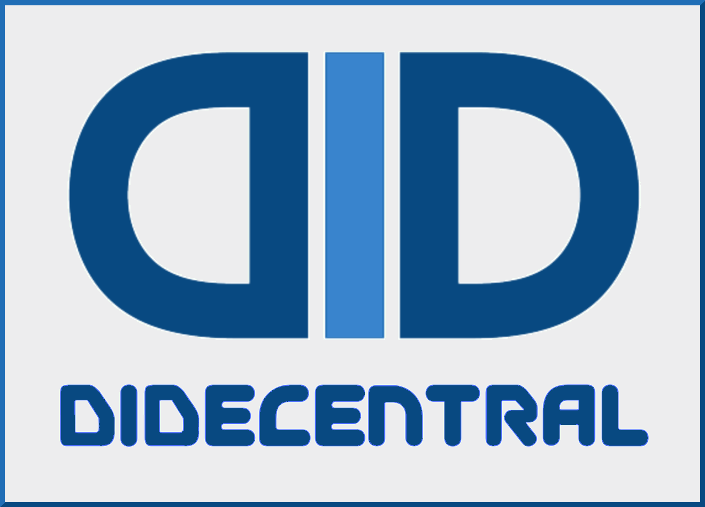

# [decentralized-id.com](https://decentralized-id.com)

>A good self‐sovereign identity system will allow individuals to directly influence how companies, governments, and others correlate our interactions across different services and locations by default. It won’t fix all identity problems nor preclude alternative identity approaches, but it will put the individual in control of most uses of identity and give organizations a simpler, easier, more ethical way to use identity to improve how they provide services and products. When successful, it will not only enable individuals to exercise greater control over how companies and governments keep track of us, it will also illuminate those situations where self‐sovereign identity is restricted, facilitating a conversation about when and where such limits are appropriate. [Joe Andrieu -A Technology‐Free Definition of Self‐Sovereign Identity](https://github.com/jandrieu/rebooting-the-web-of-trust-fall2016/blob/master/topics-and-advance-readings/a-technology-free-definition-of-self-sovereign-identity.pdf)

## What is Decentralized ID?

That's a big question, and what follows are just some notes, until I work out a more thoughtful answer.

The essence of Decentralized-ID is in creating open standards for a privacy preserving internet-wide identity layer — not owned by any one particular organization, but interoperable between all.

It's impossible to have a conversation about decentralized-id without discussing blockchain and self sovereign identity: 
  * Self Sovereign Identity principles (with some help from the GDPR) have helped to shape the narrative around putting the identity owner in control over their personal information.
  * Excitement over Blockchain Tech has spilled over in support of longstanding efforts to create a privacy preserving internet-wide identity protocol, and inspired development of decentralized networks for online identification. 
  * The United Nations Sustainable Development Goals (SDGs) have also fueled efforts towards a global and widely accessible identity solution.

## Self Sovereign Identity

* [Christopher Allen](http://www.lifewithalacrity.com/)[[**info**](https://christophera.info/)] details the overarching history of internet idenitity standards and outlines [10 Principles of Self Sovereign Identity](https://github.com/WebOfTrustInfo/self-sovereign-identity/blob/master/self-sovereign-identity-principles.md) in his seminal work [The Path to Self-Soverereign Identity](http://www.lifewithalacrity.com/2016/04/the-path-to-self-soverereign-identity.html)[[**ϟ**](https://www.coindesk.com/path-self-sovereign-identity/amp/)]
* [<u>A Technlogy-Free Definition of Self-Sovereign Identity</u>](https://github.com/jandrieu/rebooting-the-web-of-trust-fall2016/raw/master/topics-and-advance-readings/a-technology-free-definition-of-self-sovereign-identity.pdf) is a continuation of the discussion started by Allen, offering 3 "Core Characteristics of Sovereign Identity".
* [7 Myths of Self Sovereign Identity](https://medium.com/evernym/7-myths-of-self-sovereign-identity-67aea7416b1)
* [Inevitable Rise of Self-Sovereign Identity](https://sovrin.org/wp-content/uploads/2018/03/The-Inevitable-Rise-of-Self-Sovereign-Identity.pdf)
* [SSIMeetup](http://ssimeetup.org/) [[**S**](https://www.slideshare.net/SSIMeetup/presentations)] [[**V**](https://www.youtube.com/channel/UCSqSTlKdbbCM1muGOhDa3Og)] [[**tele**](https://t.me/SSIMeetup)]
\- SSI Meetup is an open, collaborative community to help SSI evangelists around the world, independent of company interests or standards. 
* [SSI: A Roadmap for Adoption](https://github.com/WebOfTrustInfo/rebooting-the-web-of-trust-spring2018/blob/master/final-documents/a-roadmap-for-ssi.md)
* [Matching Identity Management Solutions to Self Sovereign Identity Solutions](https://www.slideshare.net/TommyKoens/matching-identity-management-solutions-to-selfsovereign-identity-principles)
<blockquote class="twitter-tweet" data-lang="en">
0/ “Self-Sovereign Identity: A Progress Report”…
&mdash; Christopher Allen (@ChristopherA) [April 25, 2018](https://twitter.com/ChristopherA/status/989120215702261761?ref_src=twsrc%5Etfw)</blockquote>

[Self Sovereign Identity - Literature](https://decentralized-id.com/literature/self-sovereign-identity/)
Here, I've gathered literature on Self Sovereign Identity, and begun considering it comparatively.

## Directory

[SSI\DID History](https://decentralized-id.com/history/)
  * [User Centric Identity - 2000-2009](https://decentralized-id.com/history/2000-2009/)
  * [Personal Data Ecosystem - 2010-2014](https://decentralized-id.com/history/2010-2014)
  * [Blockchain Identity - 2015-2019](https://decentralized-id.com/history/2015-2019/)

[Self Sovereign Identity](https://decentralized-id.com/literature/self-sovereign-identity/)
  * [Evolution of SSI](https://decentralized-id.com/literature/self-sovereign-identity/evolution-of-ssi/)
  * [SSI Principles vs Characteristics](https://decentralized-id.com/literature/self-sovereign-identity/ssi-principles-vs-characteristics/)
  * [User Experience](https://decentralized-id.com/literature/self-sovereign-identity/user-experience/)

[DID Related Web Standards](https://decentralized-id.com/specs-standards/)
  * [XDI](https://decentralized-id.com/specs-standards/xdi/)
  * [JSON-LD](https://decentralized-id.com/specs-standards/json-ld/)

[Identity Related GitHub Repositories](https://decentralized-id.com/code/github/)

[Literature](https://decentralized-id.com/literature/)
  * [Rebooting Web of Trust - Papers Index](https://decentralized-id.com/literature/rebooting-web-of-trust/)

[Workshops](https://decentralized-id.com/workshops)
[Media](https://decentralized-id.com/media/)  (Video, Podcasts and Slideshare)
[DID Adoption](https://decentralized-id.com/adoption/)
[GDPR](https://decentralized-id.com/government/europe/regulation/gdpr)

[Organizations](https://decentralized-id.com/organizations)
  * [Decentralized Identity Foundation—DIF](https://decentralized-id.com/organizations/identity-foundation/)
  * [My Data](https://decentralized-id.com/organizations/mydata/)
  * [Sovrin Foundation](https://decentralized-id.com/organizations/sovrin/)
  * [SSI Meetup](https://decentralized-id.com/organizations/ssi-meetup/)

[Blockchain](https://decentralized-id.com/blockchain/)
  * [Bitcoin](https://decentralized-id.com/blockchain/bitcoin/)
  * [Ethereum](https://decentralized-id.com/blockchain/ethereum/)

[Hyperledger Indy](https://decentralized-id.com/hyperledger/indy/)
  * [Adoption](https://decentralized-id.com/hyperledger/indy/adoption/)
  * [Indy Github](https://decentralized-id.com/hyperledger/indy/github/)
  * [Literature](https://decentralized-id.com/organizations/sovrin/literature/)
  * [VON](https://decentralized-id.com/government/canada/von/)
[Hyperledger Global Forum](https://decentralized-id.com/hyperledger/hgf-2018/)

Private Sector
  * [IBM](https://decentralized-id.com/private-sector/ibm/)
  * [Microsoft](https://decentralized-id.com/private-sector/microsoft/)
  * [Danube Tech](https://decentralized-id.com/private-sector/danube/)

[Government](https://decentralized-id.com/government/)

## Reources

* [SSI Meetup](http://ssimeetup.org/) - [video](https://www.youtube.com/channel/UCSqSTlKdbbCM1muGOhDa3Og) - [presentations](https://www.slideshare.net/SSIMeetup/presentations/)
* [IIW-Wiki](https://iiw.idcommons.net/Main_Page)
* [wiki.idcommons.net](http://wiki.idcommons.net/Main_Page)
* [/WebOfTrustInfo](https://github.com/WebOfTrustInfo/)
* [/peacekeeper/blockchain-identity](https://github.com/peacekeeper/blockchain-identity)
* [identitywoman.net](https://identitywoman.net/)
* [windley.com/tags/identity](http://www.windley.com/tags/identity.shtml)
* [Kim Camerons Identity Blog](https://identityblog.com)

<h3>Tips Welcome</h3>
<table class="table table-bordered table-hover table-condensed">
  <thead>
    <tr>
      <th title="Field #1">Bitcoin</th>
      <th title="Field #2">DOGE</th>
    </tr>
    </thead>
    <tbody>
    <tr>
      <td>1D9382Y1hwF9mx8tRu8ZUVxcm2aq6yZDYR</td>
      <td>D9y38ChAZP9aZG2mAJ94VAynAG4YGSvTpp</td>
    </tr>
    <tr>
      <td></td>
      <td></td>
    </tr>
  </tbody>
</table>  
